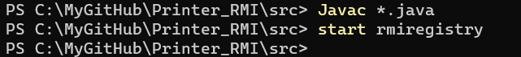
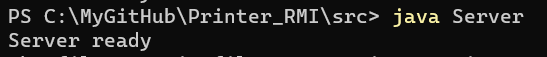
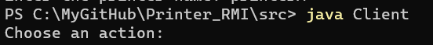
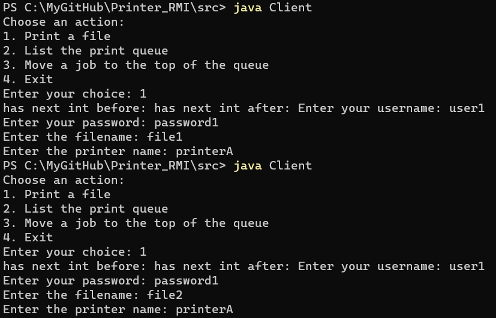
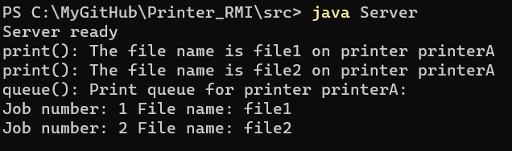
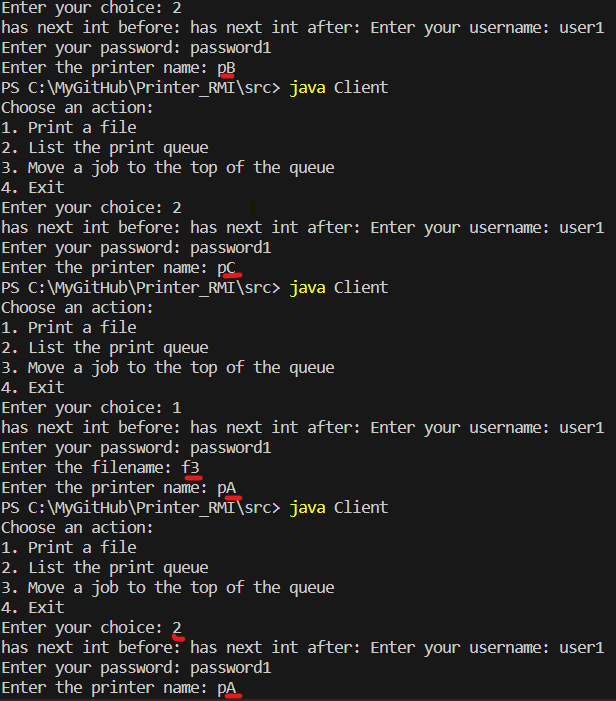
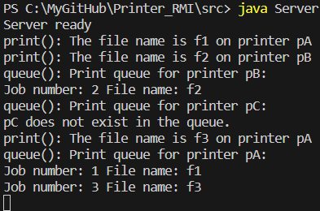
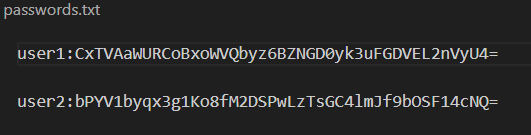

# Printer_RMI

a simple client/server application using RMI. The example used in this lab is a mock-up of a simple authenticated print server, such as a print server installed in a small company.

https://www.tutorialspoint.com/java_rmi/java_rmi_application.htm

# Printer_RMI

a simple client/server application using RMI. The example used in this lab is a mock-up of a simple authenticated print server, such as a print server installed in a small company.

The print server must support the following operations:

- print(String filename, String printer);   // prints file filename on the specified printer
- queue(String printer);   // lists the print queue for a given printer on the user's display in lines of the form `<job number>`   `<file name>`
- topQueue(String printer, int job);   // moves job to the top of the queue
- start();   // starts the print server
- stop();   // stops the print server
- restart();   // stops the print server, clears the print queue and starts the print server again
- status(String printer);  // prints status of printer on the user's display
- readConfig(String parameter);   // prints the value of the parameter on the print server to the user's display
- setConfig(String parameter, String value);   // sets the parameter on the print server to value

# how to use the program

1. Open the folder where you have stored all the programs, in this case /src, and compile all the Java files as shown below.

```
Javac *.java
```

2. Start the rmi registry using the following command.

```
start rmiregistry
```




```
Java Server
```



```
Java Client
```



3. process of choosing operations, authentication, and how what the server print out after an operation is done. It showcases print() and queue() operations:





in case of multiple printers:





4. Authentication is done by using hash, secret key and encryption, user name is being encrypted(**AES**), password being hashed by **SHA-256,** and a AES secretKey to encrypt/decrypt user name. This is an example of **public file** storing credentials.
   
5.
