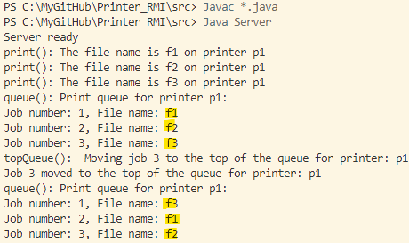
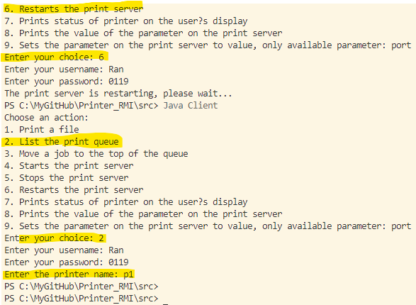
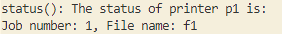
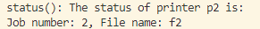
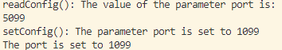

## Printer_RMI

a simple client/server application using RMI. The example used in this lab is a mock-up of a simple authenticated print server, such as a print server installed in a small company.

The print server must support the following operations:

- print(String filename, String printer);   // prints file filename on the specified printer
- queue(String printer);   // lists the print queue for a given printer on the user's display in lines of the form `<job number>`   `<file name>`
- topQueue(String printer, int job);   // moves job to the top of the queue
- start();   // starts the print server
- stop();   // stops the print server
- restart();   // stops the print server, clears the print queue and starts the print server again
- status(String printer);  // prints status of printer on the user's display
- readConfig(String parameter);   // prints the value of the parameter on the print server to the user's display
- setConfig(String parameter, String value);   // sets the parameter on the print server to value

## Introduction

### how to use the program

1. Open the folder where you have stored all the programs, in this case /src, and compile all the Java files as shown below.

```
Javac *.java
```

2. Start the rmi registry using the following command.

```
start rmiregistry
```


```
Java Server
```


```
Java Client
```


3. user and password to use:

   ```
           userPasswords.put("user1", "password1");
           userPasswords.put("user2", "password2");
           userPasswords.put("Ran", "0119");
           userPasswords.put("Alice", "alice");
           userPasswords.put("Bob", "bob");
           userPasswords.put("Cecilia", "cecilia");
           userPasswords.put("David", "david");
           userPasswords.put("Erica", "erica");
           userPasswords.put("Fred", "fred");
           userPasswords.put("George", "george");
   ```
4. process of choosing operations, authentication, and how what the server print out after an operation is done. It showcases print(), queue() and topQueue() operations:


in case of multiple printers:




After restart, the queue is cleared.



status:





readConfig and setConfig:



## Authentication

### Password Storage

#### Analysis of the 3 solutions

1. System File

For convinence's sack in this lab, I use **public file** to store user credential. ``Confidentiality`` is reached as I encrypted(**AES**) username and password. I do not implement ``integrity`` due to practical matters. However, I should emphasis that normal user should not have write access to the file, in the implementation phase I just mimic that I have ``admin role``, and ``manualy`` upsert data to the file. If normal user want to update password, they should go through an ``extra authentication`` process by proving they are who they claim they are. When they are anthenticated, a process with admin role will update the password.


### Password transport

Regarding Passwords Transport, we operate under the assumption that Transport Layer Security (TLS) is already implemented within our system. TLS plays a critical role in ensuring the secure transmission of passwords between the client and server, safeguarding sensitive information from potential interception by unauthorized entities.

### Password verification

### Session management

## Access Control Lists

## Role Based Access Control

## Changes in the policy

## Evaluation

## Conclusion
