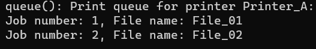

# Printer_RMI

a simple client/server application using RMI. The example used in this lab is a mock-up of a simple authenticated print server, such as a print server installed in a small company.

https://www.tutorialspoint.com/java_rmi/java_rmi_application.htm

# Printer_RMI

a simple client/server application using RMI. The example used in this lab is a mock-up of a simple authenticated print server, such as a print server installed in a small company.

The print server must support the following operations:

- print(String filename, String printer);   // prints file filename on the specified printer
- queue(String printer);   // lists the print queue for a given printer on the user's display in lines of the form `<job number>`   `<file name>`
- topQueue(String printer, int job);   // moves job to the top of the queue
- start();   // starts the print server
- stop();   // stops the print server
- restart();   // stops the print server, clears the print queue and starts the print server again
- status(String printer);  // prints status of printer on the user's display
- readConfig(String parameter);   // prints the value of the parameter on the print server to the user's display
- setConfig(String parameter, String value);   // sets the parameter on the print server to value

# how to use the program

1. Open the folder where you have stored all the programs, in the root repo, compile all the Java files as shown below.

```
PS C:\Mygit\Printer_RMI> javac -cp ".;lib/*" src/*.java
```

2. Start the rmi registry using the following command.

```
PS C:\Mygit\Printer_RMI> start rmiregistry
```

3. start server and client.
```
PS C:\Mygit\Printer_RMI> java -cp ".;lib/*;src" Server

```


```
PS C:\Mygit\Printer_RMI\src> java Client
```
4. Public file store user name and hashed password. passwords are just "password1", "password2", "password3" respectively.
```
user1:CxTVAaWURCoBxoWVQbyz6BZNGD0yk3uFGDVEL2nVyU4=
user2:bPYV1byqx3g1Ko8fM2DSPwLzTsGC4lmJf9bOSF14cNQ=
user3:WQasNhoTfi0oZGXNZYjrtaw/WulVABEAvEFXfD11F2Q=
```

5. Design of RBAC at very basic level, just to demonstrate the concept. it includes the basic components role, permmision, user. 

```
{
  "users": [
    {
      "username": "user1",
      "role": "admin",
      "permissions": ["print", "queue", "topQueue","start","stop"]
    },
    {
      "username": "user2",
      "role": "reader",
      "permissions": ["queue"]
    },
    {
      "username": "user3",
      "role": "operator",
      "permissions": ["print", "queue", "topQueue"]
    }
  ]
}
```


6. Authentication is done by using hash, secret key and encryption, user name is being encrypted(**AES**), password being hashed by **SHA-256,** and a AES secretKey to encrypt/decrypt user name. This is an example of **public file** storing credentials.
   

7. Demonstrate users' permissions depending on the role they are assigned to:
   a. user1 has admin role, he starts printer and add a couple of printing jobs:
   
   
   

   b. user1 moves the second job to the top of the queue.
   
   

   c. user1 can also list the queue:
   
   

   d. user2 has only reader role, he does not has permissions to start, stop and create printing jobs. attempts doing so will result in failour. 
   
   
   
   he can only print the queue:
   
   

   e. user3 has operator role, he has all permissions defined so far, but start and stop.
   I will try to let user3 to move job NO.1 back to the top again:
   
   
   user3 list the reordered queue:
   
   

   f. user1 stops the printer, all the printing jobs are cleared up.
   
   

