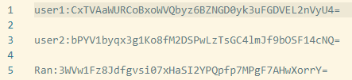
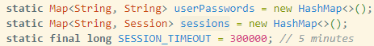
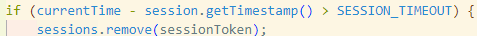

## Introduction

## Authentication

### Password Storage

user and password:

```
userPasswords.put("user1", "password1");        userPasswords.put("user2", "password2");        userPasswords.put("Ran", "0119");        userPasswords.put("Alice", "alice");        userPasswords.put("Bob", "bob");        userPasswords.put("Cecilia", "cecilia");        userPasswords.put("David", "david");        userPasswords.put("Erica", "erica");        userPasswords.put("Fred", "fred");    userPasswords.put("George", "george");
```


#### Analysis of the 3 solutions

1. System File
   For implementation, the credentials are stored in a ``system file`` that is protected by the OS's file system mechanisms. The file is only accessible by processes with highly ``privileged roles`` (e.g., admin). Normal users DO NOT have ``read and write`` access to the file. Passwords SHOULD BE ``encrypted`` and ``hashed`` using a strong cryptographic algorithm (e.g., AES,PBKDF2) before being stored in the file.

   **Confidentiality**: The ``OS's file system`` protection mechanisms ensure that ONLY ``authorized processes`` can access the file. ``Encryption`` adds an additional layer of security, so that even if the file is accessed, the passwords remain ``confidential``. Therefor, normal users CANNOT ``read`` the file, preventing users from ``learning`` the passwords of other users.

   **Integrity**: The ``file system`` protection mechanisms only allow processes with elevated privileges can ``update`` the file, ensuring the ``integrity`` of the stored passwords. Therefor normal users cannot change the passwords of other users without proper authentication.
2. Public File
   Passwords are stored in a ``public file`` that can be ``read by all users`` but NOT ``written`` to. Passwords SHOULD BE ``encrypted`` and ``hashed`` using a strong cryptographic algorithm (e.g., AES,PBKDF2) before being stored in the file.

   **Confidentiality**: ``Encryption`` ensures that the passwords remain ``confidential`` even though the file is ``publicly readable``. Confidentiality prevents users from learning the passwords of other users.

   **Integrity**: The file system protection mechanisms prevent unauthorized modifications to the file. However, updating passwords in such a file poses a challenge as normal users do not have write access. ``Password updates`` require a process with ``elevated privileges``, ensuring that users ``CANNOT`` change the passwords of other users without proper authentication.
3. DBMS
   The DBMS provides fine-grained access control mechanisms to manage who can read or write the password data. Passwords SHOULD BE ``encrypted`` and ``hashed`` using a strong cryptographic algorithm (e.g., AES,PBKDF2) before being stored in the file.

   **Confidentiality**: The access control ensures that only ``authorized`` users can access the password data. ``Encryption`` adds an additional layer of security, ensuring that even if the database is accessed, the passwords remain confidential. Therefor unauthorized users cannot learn the others'password.

   **Integrity**: The access control prevents unauthorized ``modifications`` to the password data(including other users'). Only authorized users can update the passwords, ensuring the integrity.

**Pros**: They all provide confidentiality and integrity, but ``DBMS`` ``fine-grained access control`` and is more flexible for managing password updates compared to the other two solutions.

**Cons**: management of file permissions and elevated privileges for password updates in ``System File`` can be complecated. ``Public File`` poses challenges for password updates due to read-only access for normal users.

Access Control: The file system protection mechanisms ensure that normal users have read-only access to the file.
Encryption: Passwords are encrypted using a strong cryptographic algorithm (e.g., AES) before being stored in the file.

For convinence's sack in this lab, I use **public file** to store user credential. ``Confidentiality`` is reached as I encrypted(**AES**) username and password. I do not implement ``integrity`` due to practical matters. However, I should emphasis that normal user should not have write access to the file, in the implementation phase I just mimic that I have ``admin role``, and ``manualy`` upsert data to the file. If normal user want to update password, they should go through an ``extra authentication`` process by proving they are who they claim they are. When they are anthenticated, a process with admin role will update the password.




### Password transport

Regarding Passwords Transport, we operate under the assumption that Transport Layer Security (TLS) is already implemented within our system. TLS plays a critical role in ensuring the secure transmission of passwords between the client and server, safeguarding sensitive information from potential interception by unauthorized entities.

### Password verification

### Session management

1. Session Generation
   The session token is generated using ``UUID.randomUUID().toString()``, which provides a ``unique and random ``token for each session. The uniqueness prevents collisions and ensuring that each session is distinct.  The server maintains a map of ``active sessions``, associating ``each session`` token with the ``corresponding user`` and ``timestamp``. This map is used to validate the session token for each request, ensuring that only valid sessions are accepted. The session token is transmitted over a secure channel (``TLS``) to prevent ``interception`` by unauthorized entities. The session token is supposed to store securely on the client side, typically in an HTTP-only cookie or a secure file system. For the purpose of this lab, I saved it in a Java object.
2. Session Lifetime
   Each session has a predefined ``timeout`` period of 5 minutes in this lab. If the session token is not used() within the timeout period, the session is considered expired, and the user must ``re-authenticate`` to obtain a new session token. Timestamp refresh ensures that active sessions remain valid while inactive sessions expire. When a session expires, the server removes the session token from the active sessions map, ensuring that expired tokens cannot be used to access the system.
   
   

My implementation ensures that the sessions are managed securely, maintaining both the integrity and confidentiality of the session tokens and the associated user data. This approach provides a balance between security and usability, allowing users to remain authenticated for a period of time while minimizing the risk of unauthorized access.

## Access Control Lists

## Role Based Access Control

## Changes in the policy

## Evaluation

## Conclusion
