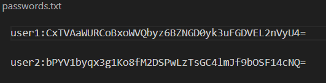
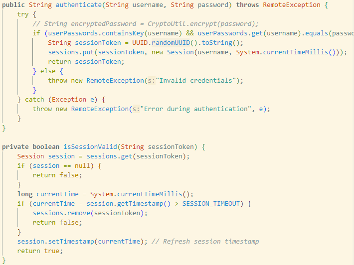

## Introduction

In client/server applications, **authentication** and **access control** are critical components for ensuring the ``confidentiality and integrity`` of the system. Authentication verifies the identity of users, while access control determines the permissions granted to authenticated users. These mechanisms are essential for protecting sensitive data and preventing unauthorized access.

##### Scope

This report addresses the following problems in the context of client/server applications:

- Authentication: Are the users whom they claim to be?
- Access Control: Can the abstraction of user roles easily managing and enforcing permissions?
  The proposed solution involves implementing a robust authentication system and a Role-Based Access Control (**RBAC**) policy. The ``authentication`` system securely ``stores and verifies`` user ``credentials``, while the RBAC policy defines roles and permissions, ensuring that users can only perform actions they are authorized for.

##### Proposed Solutions

1. Authentication:

- Password Storage: Passwords are generated using strong cryptographic algorithms (AES, PBKDF2), and supposely securely stored in an operating system's ``file system ``mechanisms or ``DBMS``. But due to time limitation, I stored the password in a ``public file``, which follows by some issues that normal user only has ``read`` access, which poses challenge to ``password updating``. This matter is discussed in the later section.
- Transportation:  In order to provide a secure communication, the Transport Layer
  Security Protocol(**TLS**) is assumed to implemented. That way, we can ensure the confidentiality and protect against malicious actions and unauthorized access.
- Verification: User credentials are verified against the stored passwords during the login process. The passwords are encrypted using ``PBKDF2WithHmacSHA256`` and ``AES`` and saved in a ``public file``. When a user ``login``, the program looks up for the entered username and encrypt the entered password, then ``verify`` the fresh encrypted password against the one mapping to the username in the file.
- Session: when verification successed, the username, encryptedPassword and randomUUID are used to creat a session. The randomness ensures uniqueness and randomness, which prevents an attacker reusing an old session token, and mitigates session hijacking, as it is extremely difficult to guess or forge a valid session token.

2. Access Control:

- Role-Based Access Control (RBAC): Roles are defined with specific permissions, and users are assigned to these roles. Permissions are enforced based on the user's role, ensuring that only authorized actions can be performed.

##### Goals are met by the program

- Secure Authentication: User credentials are securely stored and verified, preventing unauthorized access.
- Granular Access Control: Permissions are managed at the role level, allowing for fine-grained control over user actions.
- Scalability: The RBAC system is scalable, making it suitable for both small and large organizations.
- Flexibility: The access control policy can be easily updated to reflect organizational changes, ensuring that the system remains adaptable to evolving requirements.

## Authentication

### Password Storage

#### Analysis of the 3 solutions

1. System File
   For implementation, the credentials are stored in a ``system file`` that is protected by the OS's file system mechanisms. The file is only accessible by processes with highly ``privileged roles`` (e.g., admin). Normal users DO NOT have ``read and write`` access to the file. Passwords SHOULD BE ``encrypted`` and ``hashed`` using a strong cryptographic algorithm (e.g., AES,PBKDF2) before being stored in the file.

   **Confidentiality**: The ``OS's file system`` protection mechanisms ensure that ONLY ``authorized processes`` can access the file. ``Encryption`` adds an additional layer of security, so that even if the file is accessed, the passwords remain ``confidential``. Therefor, normal users CANNOT ``read`` the file, preventing users from ``learning`` the passwords of other users.

   **Integrity**: The ``file system`` protection mechanisms only allow processes with elevated privileges can ``update`` the file, ensuring the ``integrity`` of the stored passwords. Therefor normal users cannot change the passwords of other users without proper authentication.
2. Public File
   Passwords are stored in a ``public file`` that can be ``read by all users`` but NOT ``written`` to. Passwords SHOULD BE ``encrypted`` and ``hashed`` using a strong cryptographic algorithm (e.g., AES,PBKDF2) before being stored in the file.

   **Confidentiality**: ``Encryption`` ensures that the passwords remain ``confidential`` even though the file is ``publicly readable``. Confidentiality prevents users from learning the passwords of other users.

   **Integrity**: The file system protection mechanisms prevent unauthorized modifications to the file. However, updating passwords in such a file poses a challenge as normal users do not have write access. ``Password updates`` require a process with ``elevated privileges``, ensuring that users ``CANNOT`` change the passwords of other users without proper authentication.
3. DBMS
   The DBMS provides fine-grained access control mechanisms to manage who can read or write the password data. Passwords SHOULD BE ``encrypted`` and ``hashed`` using a strong cryptographic algorithm (e.g., AES,PBKDF2) before being stored in the file.

   **Confidentiality**: The access control ensures that only ``authorized`` users can access the password data. ``Encryption`` adds an additional layer of security, ensuring that even if the database is accessed, the passwords remain confidential. Therefor unauthorized users cannot learn the others'password.

   **Integrity**: The access control prevents unauthorized ``modifications`` to the password data(including other users'). Only authorized users can update the passwords, ensuring the integrity.

**Pros**: They all provide confidentiality and integrity, but ``DBMS`` ``fine-grained access control`` and is more flexible for managing password updates compared to the other two solutions.

**Cons**: management of file permissions and elevated privileges for password updates in ``System File`` can be complecated. ``Public File`` poses challenges for password updates due to read-only access for normal users.

Access Control: The file system protection mechanisms ensure that normal users have read-only access to the file.
Encryption: Passwords are encrypted using a strong cryptographic algorithm (e.g., AES) before being stored in the file.

For convinence's sack in this lab, I use **public file** to store user credential. ``Confidentiality`` is reached as I encrypted(**AES**) username and password. I do not implement ``integrity`` due to practical matters. However, I should emphasis that normal user should not have write access to the file, in the implementation phase I just mimic that I have ``admin role``, and ``manualy`` upsert data to the file. If normal user want to update password, they should go through an ``extra authentication`` process by proving they are who they claim they are. When they are anthenticated, a process with admin role will update the password.




### Password transport

Regarding Passwords Transport, we operate under the assumption that Transport Layer Security (TLS) is already implemented within our system. TLS plays a critical role in ensuring the secure transmission of passwords between the client and server, safeguarding sensitive information from potential interception by unauthorized entities.

### Session management

1. Session Generation
   The session token is generated using ``UUID.randomUUID().toString()``, which provides a ``unique and random ``token for each session. The uniqueness prevents collisions and ensuring that each session is distinct.  The server maintains a map of ``active sessions``, associating ``each session`` token with the ``corresponding user`` and ``timestamp``. This map is used to validate the session token for each request, ensuring that only valid sessions are accepted. The session token is transmitted over a secure channel (``TLS``) to prevent ``interception`` by unauthorized entities. The session token is supposed to store securely on the client side, typically in an HTTP-only cookie or a secure file system. For the purpose of this lab, I saved it in a Java object.
2. Session Lifetime
   Each session has a predefined ``timeout`` period of 5 minutes in this lab. If the session token is not used() within the timeout period, the session is considered expired, and the user must ``re-authenticate`` to obtain a new session token. Timestamp refresh ensures that active sessions remain valid while inactive sessions expire. When a session expires, the server removes the session token from the active sessions map, ensuring that expired tokens cannot be used to access the system.
   
   

### implementation

The secret key is generated based on ``PBKDF2`` with HMAC-SHA256 as the pseudorandom function, then the key is converted to an AES key. And encryption is done by using ``AES`` and the secret key. Since PBKDF2 is a widely recognized and secure key derivation function, and it takes ``a password, a salt(randomness), an iteration count``, and ``a key length`` as inputs. The iteration count (``65536``) increases the computational effort required to derive the key, making ``brute-force`` attacks more difficult. ``AES`` is a robust and widely accepted encryption standard that provides strong security. The use of a salt in the key derivation process  preventing the use of ``precomputed`` attack vectors like ``rainbow tables``.


The session is generated using a combination of ``randomUUID, username, and encryptedPassword``. By associating the ``session`` with a specific ``username``, the system can ``enforce access control policies`` and ensure that actions are performed by ``authenticated`` users. The ``encrypted password`` adds an additional layer of security by ensuring that the session is tied to the user's credentials. This makes it more difficult for an attacker to ``hijack`` the session without knowing the user's password. 
The session ``lifetime`` is set to 5 minutes, when the user is not ``active`` for more than 5 minutes, the user will be ``logged out``. But within the lifetime the user can ``effectively`` interact with the printer ``without`` being requested for ``authentication``. This will make users' interaction to the printer easier while presering ``confidentiality`` and ``integrity``. 



My implementation ensures that the sessions are managed securely, maintaining both the integrity and confidentiality of the session tokens and the associated user data. This approach provides a balance between ``security and usability``, allowing users to remain authenticated for a period of time while ``minimizing`` the risk of ``unauthorized`` access.

## Access Control Lists
The access control is directly user<-->permission mapping:

```
Alice: all
Bob: start, stop, restart, status, readConfig, setConfig
Cecilia: print, queue, topQueue, restart
David: print, queue
Erica: print, queue
Fred: print, queue
George: print, queue
```
This approach has **fine-grained control** over permissions, as each user's permissions are **explicitly** defined. straightforward and ``easy management`` for **small organisation**. The **flexibility** supports tailored permissions for each user.

But it does not well supoort **Scalability**, as the number of users grows, managing individual permissions for each user becomes increasingly complex and error-prone. **Redundancy** cannot avoid as many users share the same set of permissions, which leads to increased ``maintenance overhead``. The **lack of abstraction of roles** makes it very ``time-consuming`` and error-prone to ``implement changes``. ie. when a new permission needs to be added to a big group of users.

## Role Based Access Control

```
Alice: Admin
George: Technician
Cecilia: PowerUser
Ida: PowerUser
David: User
Erica: User
Fred: User
Henry: User
```
```
Admin: all
Technician: start, stop, restart, status, readConfig, setConfig
PowerUser: print, queue, topQueue, restart
User: print, queue
```
RBAC realy gives much more **flexibility, isolation and scalability**. Since updating roles and permissions are done by modifying the external policy and role hierarchy files ``respectively``. It can easily scale up/down for numbers of roles and permissions in a **big organisation**.

But there could be challenges for managing large numbers of roles and permissions since the **complexity** increases.

## Changes in the policy
When I assign George to Technician, while removing Bob from the role, it truely gives convinence , isolation and scalability. I only have to modify in the hierachy role file, by replacing Bob with George. Then I just added Henry and Ida wrt. their roles. The process is very ``easy to manage``, and I don't have to care about the policy file by going though all the permissions that belong to some particular role.  

whereas the access control list that directly has user<-->permission mapping is very ``time-consuming`` and ``error-prone`` to implement changes. As I have to go through along list of names. when I find a particular user, I have to scan a long list of permissions. 


## Evaluation

#### Session

I could have made the session to retain ``role`` information as opposed to currently only retaining user and encrypted password. But due to time limitation, the lab does not have this implementation.


## Conclusion

